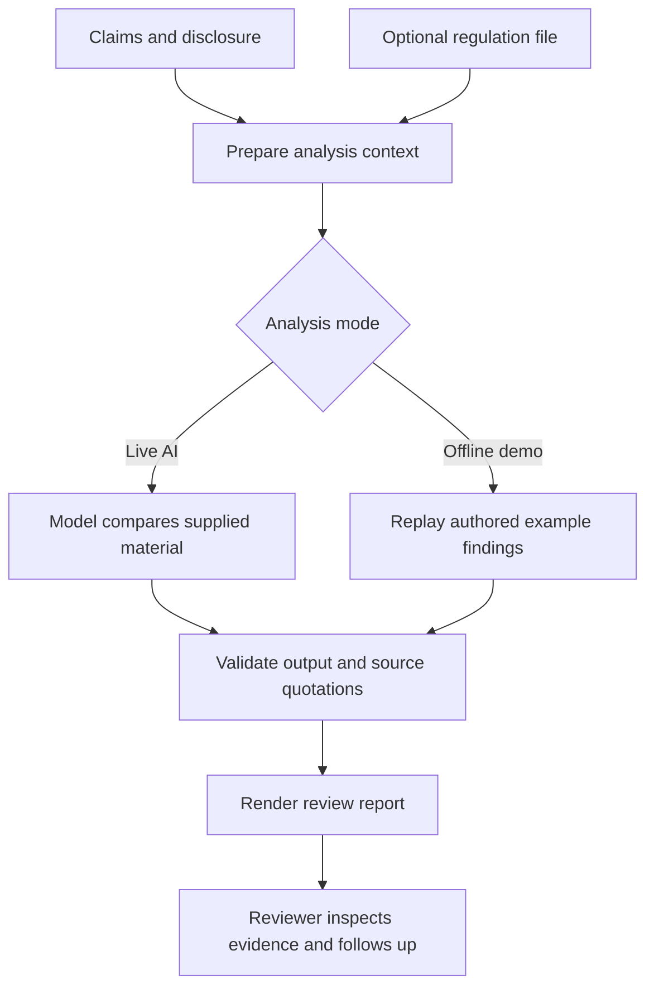

# Green Claims Checker: Business Context and End-to-End Methodology

**Project:** AI-driven comparison, testing and greenwashing screening  
**Audience:** CRO stakeholders, hackathon judges, risk reviewers and implementation teams  
**Scope:** The prototype implemented in this repository; production extensions are identified separately.

## 1. What business problem does this address?

A company can make an environmental statement that sounds stronger than the evidence behind it. A reduction in emissions intensity might be described as a reduction in total emissions; a future target might be presented as an achievement; evidence from one region might be used to support a worldwide claim.

A reviewer must connect the statement to the relevant disclosure, compare the definitions and boundaries, and decide what additional evidence is needed. When regulation is supplied, the reviewer must also consider which provision could be relevant and whether it actually applies.

This prototype organizes that work into a reviewable, claim-level evidence trail. Potential CRO applications include customer due diligence, review of sustainability-related statements and preparation of follow-up questions for relationship managers or specialist reviewers. These are intended applications, not integrations already delivered by the repository.

The business hypothesis is that a structured first review could reduce time spent finding discrepancies and preparing questions. No time saving, detection accuracy or financial benefit has yet been measured.

**The product supports human review. It does not establish deceptive intent, independently verify a company's disclosures, make a lending decision, or certify legal compliance.**

## 2. How the title maps to the product

| Component | Question it answers | Output |
| --- | --- | --- |
| Comparison | Does the statement agree with the supplied disclosure? | A comparison status and supporting source excerpts |
| Testing | Are the numbers, periods, boundaries and definitions aligned? | One or more test categories and a reasoned explanation |
| Greenwashing screening | Which statements deserve further scrutiny, and why? | Claim-level findings and specific follow-up questions |
| Regulatory reference | Does the uploaded material provide a relevant basis for an additional concern? | A separate regulatory assessment with quoted provisions |

The five business tests are analytical instructions to the model. They are not five independently implemented rule engines. Software tests in the repository serve another purpose: checking whether parsing, requests, output validation and citation handling behave as intended.

## 3. What goes in, and what comes out?

The unit of analysis is an individual environmental claim. A useful conceptual representation is:

`claim = statement + metric + unit + time period + baseline + scope + target/actual distinction`

The model is instructed to consider those dimensions. The current implementation does not extract them into a separate normalized fact table.

| Input | Current implementation |
| --- | --- |
| Green claims | User-supplied text, one claim per non-empty line; assigned IDs such as `C1` |
| Supporting disclosure | Pasted text, split into addressable passages such as `D0001` |
| Optional regulation | One PDF, UTF-8 TXT or Markdown file, uploaded through the widget or read from an accessible workspace/volume path |
| Regulation version | A label supplied by the reviewer, plus a SHA-256 hash calculated from the file bytes |

The reviewer selects the claims; automatic discovery of claims across annual reports or websites is outside this MVP. Company disclosures are supplied as text; the file-upload parser is for regulation.

Each result contains the original claim, comparison status, test categories, disclosure citations, explanation, regulatory status and citations, and a follow-up question. The report also records the run time, analysis mode, model name for live runs, source metadata, passage coverage and warnings.

## 4. End-to-end workflow

### Step 1: Define the review case

The reviewer chooses a synthetic company or enters custom material. Claims are numbered in input order. The application requires 1–15 claims, limits each claim to 2,000 characters, and accepts a non-empty disclosure of up to 35,000 characters. These are practical demo limits, not a statement about model capacity.

### Step 2: Prepare addressable evidence

Disclosure text is separated at blank lines. Long paragraphs are split at roughly 1,800 characters, preferably at a word boundary. Each passage retains a location label.

For regulation PDFs, `pypdf` extracts text page by page. References preserve the physical PDF page number and paragraph/part location. A physical page number may differ from the number printed in a document footer. TXT/MD files use paragraph locations.

The parser rejects empty or unreadable files. It reports PDF pages with no extracted text; it does not perform OCR. Current limits are 10 MB per regulation file, 250 PDF pages and 500,000 extracted characters.

Implementation: [`documents.py`](documents.py), especially `parse_document()` and `split_text()`.

### Step 3: Select regulation context

For short regulations, the model receives all extracted passages. Above a 30,000-character passage-text budget, `select_passages()` creates a keyword shortlist:

1. Combine tokens from all claims with a fixed set of environmental-review terms.
2. Score each passage by the number of distinct overlapping tokens.
3. Select passages that fit the character budget, then restore their original order.

This is simple lexical retrieval. There are no embeddings, vector database, learned reranker, legal hierarchy traversal or web search. The budget counts text characters, not model tokens or the entire request size.

This choice keeps the prototype small enough for a one-day event. It creates a concrete limitation: definitions, exceptions and related provisions can be omitted, especially if they use different terminology. The report records how many passages were used, and the notebook adds a warning when a shortlist is used.

### Step 4: Run one model request

In Live AI mode, `live_analysis()` sends one Chat Completions request containing all claims, the disclosure passages, the selected regulation passages and regulation metadata. It asks for one structured finding per claim. The synthetic expected answers are not sent to the model.

The model performs the semantic comparison and drafts the explanations. It is instructed to treat document content as data, use only supplied sources as evidence, preserve original quotations and avoid a definitive legal verdict. This is a single-model workflow; there is no agent orchestration or model tool execution.

The HTTP adapter uses Python's standard library. It accepts a full compatible endpoint URL, deployment/model name and credential. The notebook is intended to use the team's existing Azure OpenAI access. Where the organization already uses an approved SDK or gateway wrapper, that request adapter can be replaced while keeping the analysis contract and validator.

Implementation: [`ai_client.py`](ai_client.py).

### Step 5: Check five dimensions

| Test category | Review question | Example issue |
| --- | --- | --- |
| `numeric` | Does the stated amount or percentage agree with the evidence? | A 60% renewable share described as 100% |
| `time` | Are the reporting period and baseline aligned? | A reduction measured against a different year |
| `scope` | Are entities, products, geography and reporting boundaries comparable? | European packaging evidence used for a global statement |
| `metric_basis` | Does the claim use the same definition and denominator? | Emissions intensity presented as total emissions |
| `target_vs_actual` | Is an ambition clearly separated from achieved performance? | A 2040 net-zero target presented as already achieved |

A finding can carry several categories. Categories describe the reasoning used; they are not calibrated scores or a complete pass/fail matrix for every test.

### Step 6: Keep two judgments separate

**Comparison with disclosure** uses four possible outcomes:

| Status | Interpretation |
| --- | --- |
| `supported` | The statement is supported within the supplied material; independent truth has not been established |
| `contradicted` | Comparable supplied evidence conflicts with the statement |
| `insufficient_evidence` | The material does not adequately substantiate or refute the statement, or the generated evidence trail failed validation |
| `not_comparable` | Boundaries or definitions prevent the proposed comparison |

**Assessment against uploaded regulation** has its own outcomes:

| Status | Interpretation |
| --- | --- |
| `potential_issue` | A cited provision provides a possible concern for a human reviewer to assess |
| `no_issue_identified` | No issue was identified against the cited provision; this is not general regulatory clearance |
| `insufficient_information` | Further facts are needed to assess the cited provision |
| `not_assessed` | No validated regulatory assessment is available |

A contradiction in company documents does not by itself establish a regulatory violation. Equally, agreement between two company statements does not prove that either statement is true. The reviewer must assess the quality of the disclosure and the applicability of regulation.

### Step 7: Validate before presenting a conclusion

`validate_findings()` checks the model's output structure, required claim coverage, allowed statuses and test labels. Citation checks then require:

- A passage ID present in the material provided for that run.
- A quotation of at least 12 characters after whitespace normalization.
- The normalized quotation to occur within the referenced passage.

Page/paragraph locations come from the parser, not from model-generated location text.

The implementation handles a rejected citation conservatively: any rejected disclosure or regulatory reference downgrades that claim's comparison to `insufficient_evidence` and its regulatory assessment to `not_assessed`. A comparison labeled supported, contradicted or not comparable also needs at least one validated disclosure citation. Regulatory assessment requires a validated regulatory citation. Malformed output or missing/duplicate claim coverage can fail the run rather than generate a report.

**Quote verification proves that text exists in the supplied source. It does not prove that the quote supports the conclusion.** Relevance, reasoning, numerical interpretation and legal applicability remain review responsibilities.

Implementation: [`engine.py`](engine.py), `validate_findings()`; [`documents.py`](documents.py), `verify_reference()`.

### Step 8: Produce an actionable review

The HTML view places the claim, explanation, disclosure evidence and regulatory assessment together. It summarizes counts by comparison status and provides follow-up questions. It does not calculate a greenwashing probability or a calibrated company risk score.

The reviewer can inspect the original passages, request missing information, correct the statement or escalate a concern through their normal process. Those follow-up actions are suggested text; this application does not send messages or implement an approval workflow.

The notebook supports optional HTML/JSON exports. An input fingerprint and regulation hash support traceability, but there is no immutable audit store, automatic source archiving or guaranteed reproducibility of live model output.

## 5. Worked example: intensity versus absolute emissions

Case A claims that total Scope 1 and 2 emissions fell by 30%. Its disclosure states that total emissions increased from 100,000 to 108,000 tCO2e while emissions intensity fell by 30%.

For absolute emissions, the percentage change is:

`(108,000 / 100,000 - 1) × 100 = +8%`

Intensity uses a denominator: `emissions intensity = emissions / production`. A company can reduce emissions per unit of output while increasing its total emissions as production grows. The stated intensity reduction therefore cannot substantiate the claimed absolute reduction.

The intended comparison result is `contradicted`, with numeric, metric-basis and time test labels. A useful follow-up asks the company to qualify the intensity statement and disclose the absolute increase.

The fictional demo standard contains an Article 2 about this distinction. In Live AI mode, the model can cite its actual text and explain a potential issue under that fictional standard. In Offline demo mode, the application may show the passage only as a candidate; it does not perform a regulatory assessment.

Python's separate arithmetic display calculates changes from authored synthetic facts when the disclosure matches a known example. It does not extract arbitrary numeric facts from uploaded documents, and it does not independently adjudicate the model's comparison result.

## 6. Why three synthetic companies?

| Case | Purpose | Authored expected comparison results |
| --- | --- | --- |
| A — Verdant Manufacturing | Demonstrate clear contradictions: intensity/total confusion, partial renewable coverage and target/achievement confusion | Three contradicted |
| B — Blueleaf Consumer Goods | Demonstrate uncertainty: regional evidence, missing product-level substantiation and changed reporting boundaries | Two insufficient evidence; one not comparable |
| C — Clearpath Components | Demonstrate statements with aligned definitions, periods, scope and target language | Three supported |

The positive and uncertain cases are essential to the demonstration: a tool that labels every statement suspicious has not demonstrated useful discrimination.

All companies, figures and the bundled review standard are fictional. The nine claims are a small demonstration set, not a representative evaluation benchmark. Live model output is not guaranteed to match the authored expectations.

Data and expected findings: [`data/cases.json`](data/cases.json). Fictional standard: [`data/demo_regulation.md`](data/demo_regulation.md).

## 7. Execution modes and operational architecture

| Component or mode | Where it runs | What it actually does |
| --- | --- | --- |
| Notebook front end | Company browser connected to Databricks | Displays ipywidgets controls and HTML findings |
| Python processing | Databricks Python compute | Prepares text, calls the endpoint, validates citations and renders results |
| Live AI | Configured Azure-compatible endpoint | Analyzes the supplied material in one model request |
| Offline demo | Notebook Python compute | Replays authored findings only for unchanged example inputs; makes no model request |
| `demo.html` | Any suitable local browser | Displays prebuilt offline example reports; cannot run AI or analyze newly uploaded regulation |

The self-contained [Notebook](Green_Claims_Databricks.ipynb) embeds the code and sample data. It does not import the repository's Python modules at runtime, so downloading that one file is sufficient to obtain the application source. The company laptop needs no local Python installation.

If interactive widgets do not work, the fallback cell accepts a case, mode and regulation file path and renders the report through `displayHTML`. PDF parsing requires `pypdf`; the text workflow and HTTP adapter use the standard library. Working compute, model credentials and network access are still required for a live run.

Credentials are read from Databricks secrets or an environment variable, rather than placed in the source. The adapter does not implement Entra token acquisition or refresh. GitHub distributes source code; it does not execute the review or host the live application.

## 8. What has been demonstrated, and what remains unproven?

The delivered version passed 15 development tests covering authored cases, citation rejection, source replacement, PDF extraction/page references, HTML escaping, a simulated compatible HTTP endpoint and execution of the self-contained notebook without the optional UI.

These tests establish software behavior. They do not establish model accuracy, regulatory completeness, resistance to all prompt injection, production reliability or reviewer time savings. The development run did not validate the company's actual Azure endpoint or Databricks widget interface.

The main limitations are deliberate and visible: supplied evidence may itself be inaccurate; the uploaded regulation is not verified as the latest or applicable version; long-document retrieval can miss provisions; extraction can lose document structure; and a correctly copied quote can still be used in faulty reasoning.

Before production use, a bounded next step would be to have domain reviewers label a separate set of permissioned real claims and relevant provisions. Measure contradiction precision/recall, treatment of missing evidence, citation relevance, provision coverage and review time. Keep that evaluation set separate from examples used to develop the prompt. Document version management, improved retrieval, stronger numeric extraction and operational controls would follow based on the observed failures. None of these extensions is claimed as already implemented.

## 9. How to explain the project in three minutes

Lead with Case A's intensity-versus-total mismatch. Show the opposing source text and the follow-up question. Demonstrate a regulatory citation from an actual live run if available, naming the source accurately. Then show Case C and explain why a supported finding matters; use Case B to distinguish missing evidence from contradiction.

Finish with the intended value: a more structured and traceable first review for a CRO colleague. State whether the screen shows live AI output or an authored offline example. The detailed spoken script is in [`PITCH_3_MINUTES.md`](PITCH_3_MINUTES.md).

## 10. Where each responsibility lives in the code

| File | Responsibility |
| --- | --- |
| [`documents.py`](documents.py) | Parsing, passage locations, regulation selection and exact quote checks |
| [`engine.py`](engine.py) | Claim preparation, response validation, offline examples, arithmetic and report structure |
| [`ai_client.py`](ai_client.py) | Analysis prompt and compatible HTTP model call |
| [`notebook_ui.py`](notebook_ui.py) | Case selection, input editing, regulation upload/path handling and review execution |
| [`render.py`](render.py) | Escaped HTML findings, source references and report download |
| [`build_samples.py`](build_samples.py) | Authored synthetic data generation |
| [`build_deliverables.py`](build_deliverables.py) | Embeds modules and examples into the standalone notebook and offline HTML |
| [`tests/test_workflow.py`](tests/test_workflow.py) | Software behavior tests, including the simulated endpoint |

For setup instructions and environment troubleshooting, see [`README.md`](README.md). If source modules change, regenerate the notebook using `build_deliverables.py`; an already exported notebook does not automatically receive module updates.
